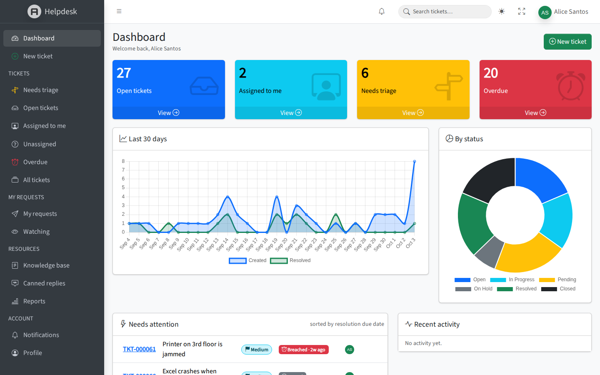
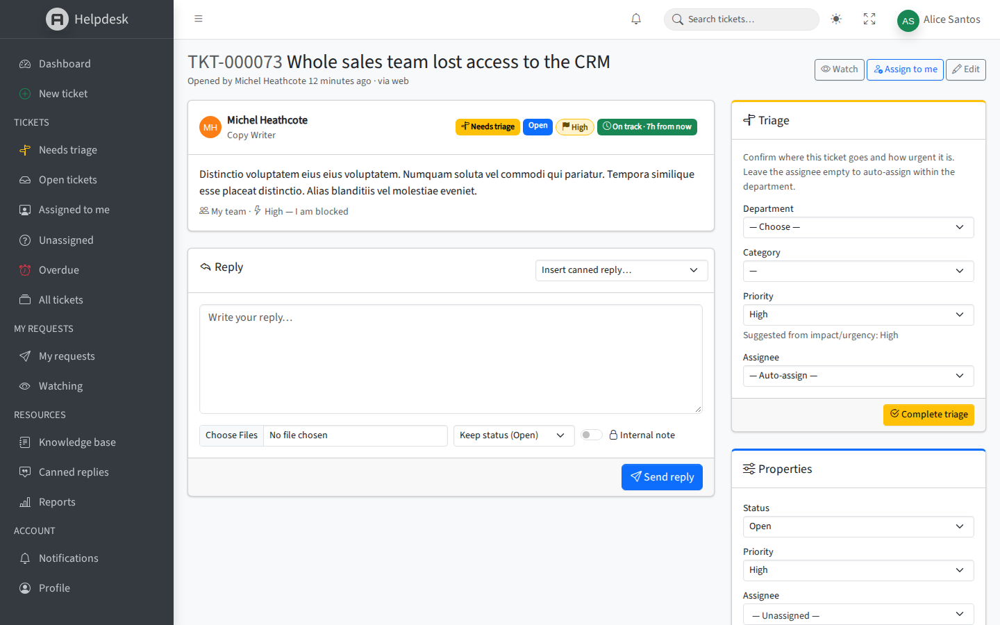
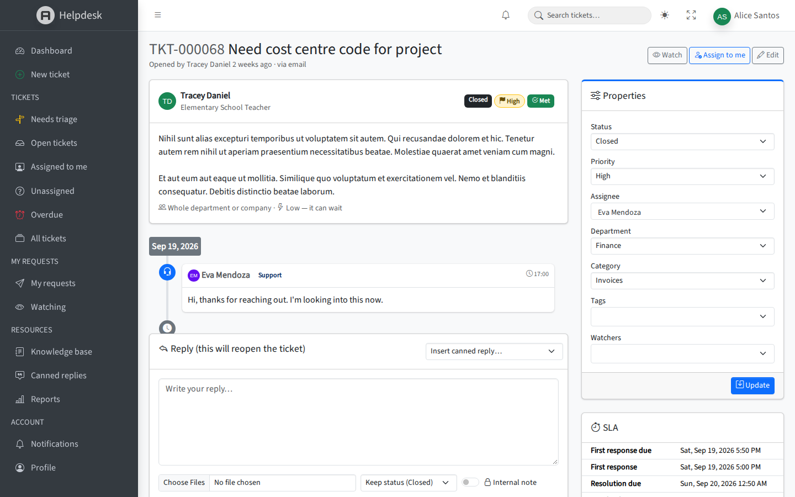
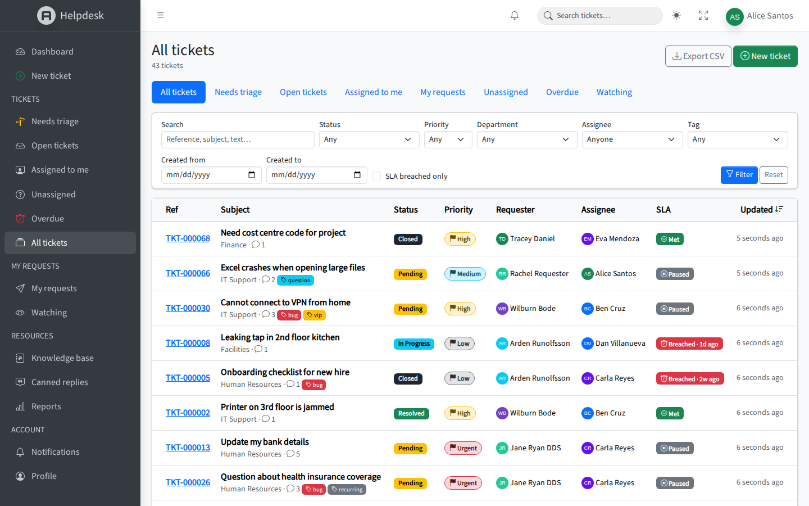
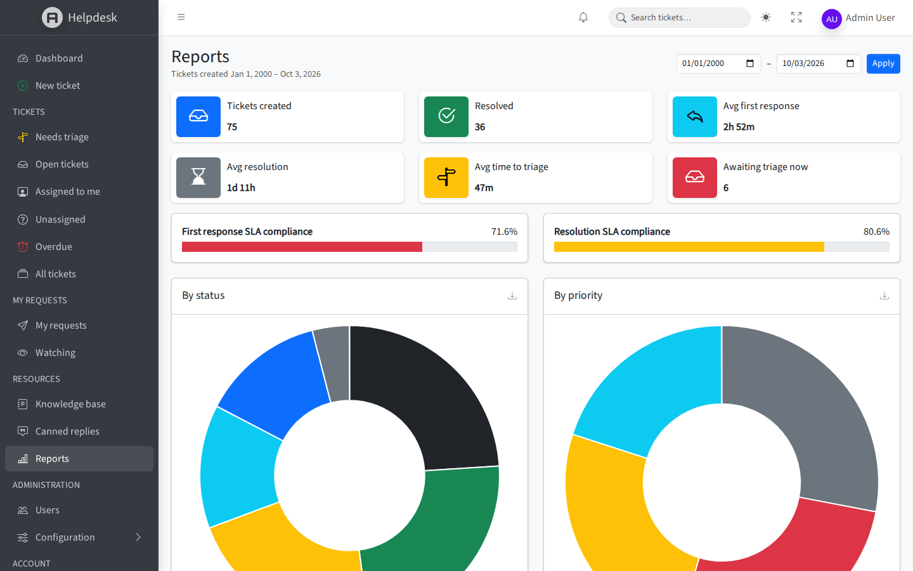

# Helpdesk

[](https://github.com/gregamano3/ticketing_php/actions/workflows/ci.yml)
[](LICENSE)

An open-source internal helpdesk ticketing system built with **Laravel 13**, **PostgreSQL** and **AdminLTE 4** (`jeroennoten/laravel-adminlte`). It has triage, SLAs with escalation, a knowledge base and reports, and it's tested end to end in a real browser.



<table>
  <tr>
    <td></td>
    <td></td>
  </tr>
  <tr>
    <td></td>
    <td></td>
  </tr>
</table>

## Features

- **Tickets:** references (`TKT-000123`), departments, nested categories, priorities, statuses, tags, watchers (CC), attachments, internal notes, and PostgreSQL full-text search
- **Roles:** Admin, Agent and Requester (`spatie/laravel-permission`)
  - Agents see their department's tickets
  - Requesters see their own tickets and the ones they watch
- **Routing:** a category implies its department, and can set a minimum priority. New tickets are auto-assigned to the least-busy agent in the department.
- **Triage:**
  - Requester tickets land in a **Needs triage** queue. Requesters describe impact and urgency, and the system suggests a priority from those.
  - First-line triagers (admins, plus agents granted *Triage access*) see the queue across all departments. They confirm the department, category, priority and assignee in one step.
  - Wrongly routed tickets can be **sent back to triage** with a reason.
  - Tickets left untriaged longer than `HELPDESK_TRIAGE_MINUTES` escalate to the triagers.
- **SLA:** response and resolution targets per priority
  - The clock pauses on *Pending* or *On Hold* statuses
  - A scheduled breach check runs every 5 minutes
  - Escalation has two levels: first the assignee and department lead, then the admins after `HELPDESK_ESCALATION_L2_MINUTES`
- **Notifications:** queued email plus an in-app bell on create, assign, reply, status change and SLA breach
- **Audit log:** every property change is shown on the ticket (`spatie/laravel-activitylog`)
- **Knowledge base:** a rich-text editor (Quill, sanitized with HTMLPurifier), full-text search, drafts and helpful votes
- **Canned replies:** shared and personal, with `{requester}`, `{agent}` and `{reference}` placeholders
- **Reports:** volume by status, priority, department and category, agent performance and SLA compliance, all with CSV export
- **Admin:** user management (roles, activate/deactivate) plus configuration for departments, categories, priorities and SLA, statuses, tags and KB categories

## Getting started (Laravel Sail)

Requires Docker.

```bash
cp .env.example .env            # DB_CONNECTION=pgsql, QUEUE_CONNECTION=redis
docker run --rm -u "$(id -u):$(id -g)" -v "$PWD":/app -w /app composer install --ignore-platform-reqs
./vendor/bin/sail up -d
./vendor/bin/sail artisan key:generate
./vendor/bin/sail artisan migrate --seed
./vendor/bin/sail artisan storage:link
```

Run these in separate terminals:

```bash
./vendor/bin/sail artisan queue:work      # sends notifications
./vendor/bin/sail artisan schedule:work   # SLA breach checks
```

- App: http://localhost
- Mailpit (outgoing mail): http://localhost:8025

> On SELinux hosts (e.g. Fedora), the bind mounts in `compose.yaml` carry the `:z` label. If port 6379 is taken locally, set `FORWARD_REDIS_PORT` in `.env`.

### Demo accounts

All demo accounts use the password `password`. They're seeded only outside production (`APP_ENV=production` skips the demo seeder), so never run `DemoSeeder` on a real installation.

| Role      | Email                 |
|-----------|-----------------------|
| Admin     | `admin@example.com`   |
| Agent     | `agent@example.com` (IT Support, triager) |
| Requester | `user@example.com`    |

## Tests

```bash
./vendor/bin/sail artisan test     # PHPUnit feature tests (PostgreSQL `testing` DB)
bin/e2e                            # Playwright browser tests (or: npm run e2e)
```

`bin/e2e` **reseeds the dev database** with demo data, starts a queue worker,
and runs Playwright (Chromium) from the official Docker image against
http://localhost. It drives the app as admin, agent and requester, checks
emails in Mailpit, and fails on any browser console error. Extra arguments go
to Playwright, e.g. `bin/e2e -g journey` or `bin/e2e --repeat-each=3`.
Reports and traces of failures land in `storage/e2e/`.

CI (GitHub Actions) runs Pint, PHPUnit and the Playwright suite on every pull request.

## Configuration

Settings live in `config/helpdesk.php` and can be overridden from `.env`:

| Variable | Default | Purpose |
|---|---|---|
| `HELPDESK_REFERENCE_PREFIX` | `TKT-` | Prefix for ticket references |
| `HELPDESK_AUTO_ASSIGN` | `true` | Auto-assign new tickets within the department |
| `HELPDESK_ESCALATION_L2_MINUTES` | `60` | Delay before a breached ticket escalates to the admins |
| `HELPDESK_TRIAGE_MINUTES` | `60` | How long a ticket may wait in triage before escalating |
| `HELPDESK_AT_RISK_MINUTES` | `60` | When the SLA badge turns "at risk" |
| `HELPDESK_ATTACHMENT_MAX_KB` | `10240` | Maximum size per attachment |

## Contributing

Contributions are welcome. See [CONTRIBUTING.md](CONTRIBUTING.md) for the workflow, tests and code style, and the [Code of Conduct](CODE_OF_CONDUCT.md).

## Security

Please report vulnerabilities privately, as described in [SECURITY.md](SECURITY.md). Don't open public issues for them.

## License

Helpdesk is open-source software licensed under the [MIT license](LICENSE).

It builds on [Laravel](https://laravel.com), [AdminLTE](https://adminlte.io) via [Laravel-AdminLTE](https://github.com/jeroennoten/Laravel-AdminLTE), [spatie/laravel-permission](https://github.com/spatie/laravel-permission), [spatie/laravel-activitylog](https://github.com/spatie/laravel-activitylog), [HTMLPurifier for Laravel](https://github.com/mewebstudio/Purifier), Bootstrap, Bootstrap Icons, Tom Select, Quill and Chart.js. Each is distributed under its own license. The bundled Source Sans 3 font is licensed under the SIL Open Font License 1.1.

